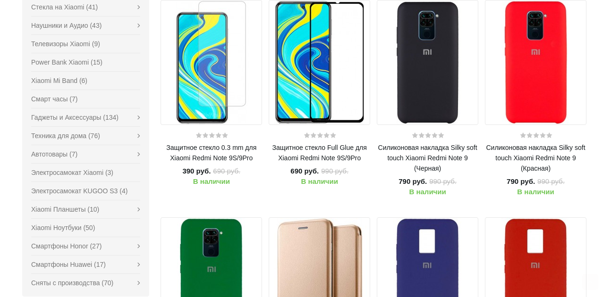

# Парсер интернет магазина
Данная программа получает самую низкую цену, указанного названия товара, как аргумент. После этого сохраняет скриншот списка товаров с низкими ценами в папку screenshots. 
<br>Используемый интернет магазин - <https://mistoreufa.ru>

## Установка проекта
```
git clone https://github.com/PanovYuri/selenium_parsing_onlineshop_infotecs.git
```

## Как работает программа
Составление URL адреса.
```
private static final String URL = "https://mistoreufa.ru/index.php?route=product/isearch&sort=p.price&order=ASC&search=%s";
...
driver = new FirefoxDriver();
driver.get(String.format(URL, args[0]));
```
HTML товара
```
<div class="caption">
    <h4>
        <a href="...">Название продукта</a>
    </h4>
    <p class="price">
        <span class="price-new">Новая цена</span>
        <span class="price-old">Старая цена</span>
    </p>
</div>
```
Для захвата нескольких товаров для скриншота требуется прокрутить страницу
```
((JavascriptExecutor) driver)
    .executeScript("arguments[0].scrollIntoView(true);", productBlock);
```

## Пример работы
Название товара ***redmi note 9***
```
https://mistoreufa.ru/index.php?route=product/isearch&sort=p.price&order=ASC&search=redmi
```
Вывод программы
```
Защитное стекло 0.3 mm для Xiaomi Redmi Note 9S/9Pro: 390 руб.
Сохранение скриншота завершилась успешно
```
Созданый скриншот 

